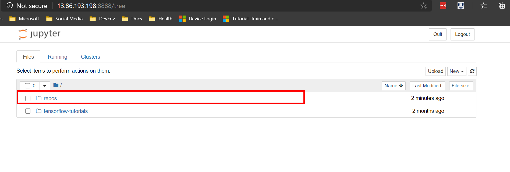

# Running Notebooks on ACI

This repo demonstrates how you can run Jupyter(lab) on Azure Container Instance (ACI). The key idea here is the interactive session is being run in a container, thus aiding:

* Reproducibility
* Smoothing the path to running a job

## Create an Azure Resource Group

Using the Azure CLI, create a new resource group:

```bash
RG=notebooks-on-aci-rg
az group create -l westus2 -n $RG
```

## CPU: Simple Example
To begin, you are going to start with a 'simple example' that runs the [tensorflow/tensorflow:latest-jupyter](https://hub.docker.com/r/tensorflow/tensorflow/) image from dockerhub on ACI.

The configuration file (`aci-configs/cpu-simple.yaml`) for running this container is as follows:

```yaml
additional_properties: {}
apiVersion: '2019-12-01'
name: cpucontainergroup
location: westus2
properties:
  containers:
  - name: cpucontainer
    properties:
      image: tensorflow/tensorflow:latest-jupyter
      resources:
        requests:
          cpu: 4
          memoryInGB: 14
      volumeMounts:
      - name: azuremlexamples
        mountPath: /tf/repos
      ports:
      - port: 8888
  osType: Linux
  volumes:
  - name: azuremlexamples
    gitRepo:
      repository: https://github.com/Azure/azureml-examples
  ipAddress:
    type: Public
    ports:
    - protocol: tcp
      port: 8888
  restartPolicy: OnFailure
```

__Note:__ in this config we are asking ACI to 'mount' a GH repo (this clones the GH repo into a folder path).

Create the container using:

```bash
az container create --resource-group $RG --file ./aci-configs/cpu-simple.yaml
```

__It should take around 2-3minutes for the container to be provisioned.__

This repo has a small bash utility script that extracts the URL to access jupyter, run this to access jupyter:

```bash
./utils/show-jupyter-url.sh $RG cpucontainergroup cpucontainer
```

When you access jupyter, you will notice that there is a directory called `repos`, which contains `azureml-examples` cloned from GitHub:



To stop the container run:

```bash
az container stop --resource-group $RG --name cpucontainergroup
```

## GPU: Simple Example

Here we will start a container that uses a docker image that has been configured for GPU - [tensorflow/tensorflow:latest-gpu-jupyter](https://hub.docker.com/r/tensorflow/tensorflow/).

The configuration file (`aci-configs/gpu-simple.yaml`) includes the specification for GPU resource:

```yaml
gpu:
    count: 1
    sku: K80
```

i.e. you will have a container with 1 K80 GPU card (V100 cards are also available).

To run this container:

```bash
az container create --resource-group $RG --file ./aci-configs/gpu-simple.yaml
```

__NOTE: It will take around 5minutes for the GPU container to be provisioned.__

Get the Jupyter URL:

```bash
./utils/show-jupyter-url.sh $RG gpucontainergroup gpucontainer
```

Copy-and-paste the URL into a browser.

To stop the container run:

```bash
az container stop --resource-group $RG --name cpucontainergroup
```
